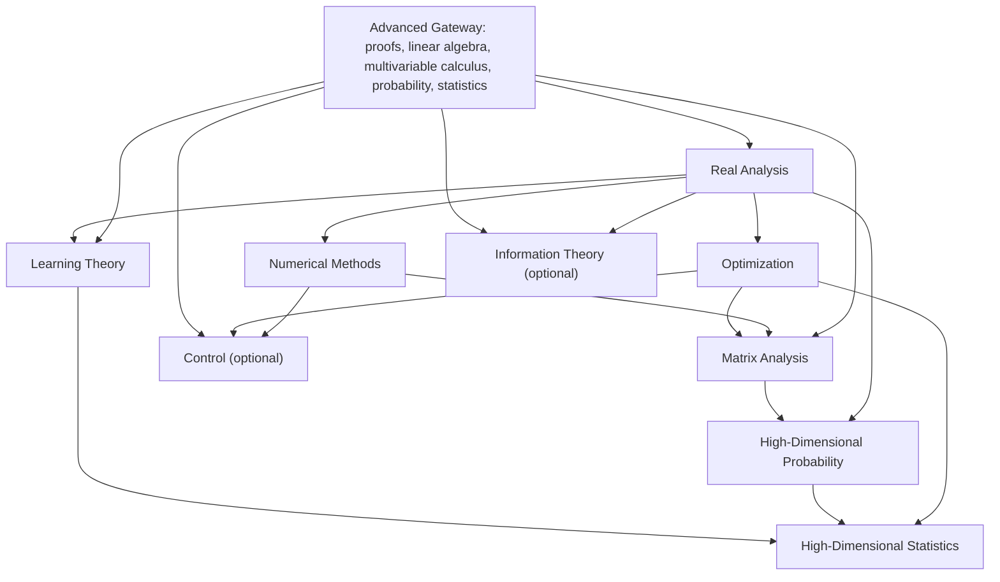

# Advanced Syllabus Tree

## Goal

Design the `advanced half` of a public `math-for-CS/AI/engineering` site so that it:

- has a clear `dependency flow`
- supports `research paper reading`
- explains each topic with both `rigor` and `application`
- keeps `books, courses, notes, and papers` as references, not as the site's main identity

This tree starts after the learner already has working foundations in:

- proof writing
- linear algebra
- multivariable calculus
- probability
- statistics
- basic ODE / dynamical systems intuition

## Design Rules

1. The site should be organized by `mathematical objects and skills`, not by textbooks or schools.
2. Each module should answer three questions:
   - `What is the math?`
   - `Why does it matter in research?`
   - `How do I use it in proofs, algorithms, and papers?`
3. Each topic page should connect `formal theory -> computation -> papers -> active directions`.
4. Advanced topics should be taught in `layers`, so learners can stop at a useful depth and still keep moving.

## Dependency Flow

Use this as the main flow for the advanced half:



## Recommended Module Order

### Core spine

1. `Real Analysis`
2. `Optimization`
3. `Numerical Methods`
4. `Matrix Analysis`
5. `Learning Theory`
6. `High-Dimensional Probability`
7. `High-Dimensional Statistics`

### Optional branches

8. `Information Theory`
9. `Control`

## Why This Order Works

- `Real Analysis` is the rigor engine. It upgrades the learner from computational fluency to proof fluency around convergence, continuity, compactness, and limiting arguments.
- `Optimization` is the main modeling and algorithmic language for AI, ML, and engineering.
- `Numerical Methods` teaches what happens when exact math becomes finite computation: stability, conditioning, approximation, and scale.
- `Matrix Analysis` deepens the spectral and PSD toolkit that underlies modern optimization, ML theory, signal processing, and high-dimensional work.
- `Learning Theory` is the first module that directly trains the learner to read modern ML theory papers.
- `High-Dimensional Probability` is the main non-asymptotic toolkit upgrade.
- `High-Dimensional Statistics` then turns those tools into estimation, inference, recovery, and modern theory practice.
- `Information Theory` and `Control` should branch only after the learner already has a stable core.

## Site Tree

```text
advanced/
  index.md
  dependency-flow.md
  how-to-use-the-advanced-track.md
  research-reading-checkpoints.md

  real-analysis/
    index.md
    rigorous-convergence.md
    continuity-compactness-completeness.md
    sequences-and-series-of-functions.md
    differentiation-and-integration-as-theorems.md
    fixed-point-implicit-and-inverse-function-ideas.md
    applications-in-optimization-probability-and-learning.md
    paper-bridge.md

  optimization/
    index.md
    convex-sets-and-separation.md
    convex-functions-and-subgradients.md
    unconstrained-first-order-methods.md
    constrained-optimization-kkt-and-lagrangians.md
    duality-and-certificates.md
    stochastic-and-proximal-methods.md
    nonconvex-landscape-intuition.md
    applications-in-ml-signal-and-control.md
    paper-bridge.md

  numerical-methods/
    index.md
    floating-point-conditioning-and-stability.md
    direct-linear-solvers-and-factorizations.md
    iterative-methods-and-preconditioning.md
    eigenvalue-and-svd-computation.md
    interpolation-approximation-and-quadrature.md
    nonlinear-equations-and-optimization-solvers.md
    randomized-and-large-scale-numerics.md
    applications-in-scientific-ml-and-engineering.md
    paper-bridge.md

  matrix-analysis/
    index.md
    norms-singular-values-and-operator-viewpoints.md
    psd-matrices-loewner-order-and-quadratic-forms.md
    spectral-theorems-and-functional-calculus.md
    perturbation-interlacing-and-stability.md
    trace-determinant-and-matrix-inequalities.md
    low-rank-kernel-and-geometry-links.md
    applications-in-optimization-learning-and-random-matrices.md
    paper-bridge.md

  learning-theory/
    index.md
    erm-and-uniform-convergence.md
    pac-vc-and-sample-complexity.md
    rademacher-stability-and-generalization.md
    surrogate-losses-regularization-and-margin.md
    online-learning-and-optimization-links.md
    modern-generalization-double-descent-and-implicit-bias.md
    applications-in-classification-representation-and-foundation-models.md
    paper-bridge.md

  high-dimensional-probability/
    index.md
    concentration-of-measure.md
    subgaussian-subexponential-and-psi-norms.md
    random-vectors-covering-and-geometry.md
    random-matrices-and-spectral-concentration.md
    chaining-symmetrization-and-empirical-process-flavor.md
    dimension-reduction-and-embedding-results.md
    applications-in-ml-statistics-and-signal-processing.md
    paper-bridge.md

  high-dimensional-statistics/
    index.md
    sparsity-regularization-and-structural-assumptions.md
    lasso-compressed-sensing-and-convex-recovery.md
    estimation-rates-minimax-and-non-asymptotic-bounds.md
    inference-after-selection-and-debiasing.md
    low-rank-graphical-and-latent-structure-models.md
    robust-and-distribution-shift-aware-estimation.md
    applications-in-causal-bio-and-modern-ml.md
    paper-bridge.md

  branches/
    information-theory/
      index.md
      entropy-mutual-information-and-kl.md
      coding-channel-capacity-and-converse-proofs.md
      rate-distortion-and-representation.md
      information-theoretic-lower-bounds.md
      applications-in-ml-language-and-communication.md
      paper-bridge.md

    control/
      index.md
      linear-systems-stability-and-state-space.md
      controllability-observability-and-realization.md
      optimal-control-and-dynamic-programming.md
      stochastic-control-and-mdp-bridges.md
      robust-nonlinear-and-learning-based-control.md
      applications-in-robotics-rl-and-systems.md
      paper-bridge.md

  page-types/
    module-overview.md
    topic-page.md
    theorem-page.md
    proof-clinic.md
    worked-example.md
    computation-lab.md
    application-page.md
    paper-bridge-page.md
    frontier-page.md
    source-guide.md
    capstone-page.md
```

## Module Architecture

Each module should have:

- one `module overview`
- `6 to 8 core topic pages`
- one `applications` page
- one `paper bridge` page

That gives each module a stable shape while still letting you grow depth later.

## Module Details

## 1. Real Analysis

### Role in the site

This is the `rigor and convergence` module. It should feel like the learner is getting a sharper mathematical language for everything that comes later.

### Dependencies

- proof writing
- calculus
- linear algebra

### Core page order

1. `rigorous-convergence`
2. `continuity-compactness-completeness`
3. `sequences-and-series-of-functions`
4. `differentiation-and-integration-as-theorems`
5. `fixed-point-implicit-and-inverse-function-ideas`
6. `applications-in-optimization-probability-and-learning`
7. `paper-bridge`

### Research relevance

- convergence proofs for optimization
- uniform convergence in learning theory
- continuity and compactness arguments in existence proofs
- asymptotic reasoning in probability and statistics

## 2. Optimization

### Role in the site

This is the `objective + algorithm + certificate` module.

### Dependencies

- multivariable calculus
- linear algebra
- probability for stochastic methods
- real analysis for convergence arguments

### Core page order

1. `convex-sets-and-separation`
2. `convex-functions-and-subgradients`
3. `unconstrained-first-order-methods`
4. `constrained-optimization-kkt-and-lagrangians`
5. `duality-and-certificates`
6. `stochastic-and-proximal-methods`
7. `nonconvex-landscape-intuition`
8. `applications-in-ml-signal-and-control`
9. `paper-bridge`

### Research relevance

- training objectives in ML
- signal recovery and inverse problems
- regularization and constrained estimation
- variational formulations in control and systems

## 3. Numerical Methods

### Role in the site

This is the `what survives computation` module.

### Dependencies

- calculus
- linear algebra
- optimization helps, but is not required for the early pages

### Core page order

1. `floating-point-conditioning-and-stability`
2. `direct-linear-solvers-and-factorizations`
3. `iterative-methods-and-preconditioning`
4. `eigenvalue-and-svd-computation`
5. `interpolation-approximation-and-quadrature`
6. `nonlinear-equations-and-optimization-solvers`
7. `randomized-and-large-scale-numerics`
8. `applications-in-scientific-ml-and-engineering`
9. `paper-bridge`

### Research relevance

- understanding stability claims in algorithms papers
- reading large-scale optimization and randomized linear algebra work
- connecting theoretical guarantees to actual implementation limits

## 4. Matrix Analysis

### Role in the site

This is the `spectral and PSD toolkit` module.

### Dependencies

- linear algebra
- numerical methods helps
- optimization helps
- real analysis helps with operator-level reasoning

### Core page order

1. `norms-singular-values-and-operator-viewpoints`
2. `psd-matrices-loewner-order-and-quadratic-forms`
3. `spectral-theorems-and-functional-calculus`
4. `perturbation-interlacing-and-stability`
5. `trace-determinant-and-matrix-inequalities`
6. `low-rank-kernel-and-geometry-links`
7. `applications-in-optimization-learning-and-random-matrices`
8. `paper-bridge`

### Research relevance

- modern optimization proofs
- covariance and kernel arguments
- random matrix concentration
- low-rank methods and representation learning

## 5. Learning Theory

### Role in the site

This is the `generalization and sample complexity` module.

### Dependencies

- probability
- statistics
- optimization
- real analysis helps

### Core page order

1. `erm-and-uniform-convergence`
2. `pac-vc-and-sample-complexity`
3. `rademacher-stability-and-generalization`
4. `surrogate-losses-regularization-and-margin`
5. `online-learning-and-optimization-links`
6. `modern-generalization-double-descent-and-implicit-bias`
7. `applications-in-classification-representation-and-foundation-models`
8. `paper-bridge`

### Research relevance

- reading classical ML theory
- understanding why bounds do and do not explain modern deep learning
- connecting optimization behavior to generalization

## 6. High-Dimensional Probability

### Role in the site

This is the `concentration and random geometry` module.

### Dependencies

- probability
- matrix analysis
- real analysis

### Core page order

1. `concentration-of-measure`
2. `subgaussian-subexponential-and-psi-norms`
3. `random-vectors-covering-and-geometry`
4. `random-matrices-and-spectral-concentration`
5. `chaining-symmetrization-and-empirical-process-flavor`
6. `dimension-reduction-and-embedding-results`
7. `applications-in-ml-statistics-and-signal-processing`
8. `paper-bridge`

### Research relevance

- non-asymptotic proof techniques
- generalization and random feature analysis
- compressed sensing and sketching
- spectral guarantees for modern algorithms

## 7. High-Dimensional Statistics

### Role in the site

This is the `estimation under structure and scale` module.

### Dependencies

- statistics
- optimization
- high-dimensional probability
- learning theory helps

### Core page order

1. `sparsity-regularization-and-structural-assumptions`
2. `lasso-compressed-sensing-and-convex-recovery`
3. `estimation-rates-minimax-and-non-asymptotic-bounds`
4. `inference-after-selection-and-debiasing`
5. `low-rank-graphical-and-latent-structure-models`
6. `robust-and-distribution-shift-aware-estimation`
7. `applications-in-causal-bio-and-modern-ml`
8. `paper-bridge`

### Research relevance

- sparse and structured estimation
- robustness and uncertainty under high dimension
- modern statistical views of representation, latent structure, and shift

## 8. Optional Branch: Information Theory

### Role in the site

This is the `limits, compression, and converse proof` branch.

### Dependencies

- probability
- statistics
- real analysis helps

### Core page order

1. `entropy-mutual-information-and-kl`
2. `coding-channel-capacity-and-converse-proofs`
3. `rate-distortion-and-representation`
4. `information-theoretic-lower-bounds`
5. `applications-in-ml-language-and-communication`
6. `paper-bridge`

### Research relevance

- representation learning and compression
- communication and distributed systems
- lower bounds in statistics and learning

## 9. Optional Branch: Control

### Role in the site

This is the `dynamics, stability, and sequential decision` branch.

### Dependencies

- ODEs and dynamical systems
- linear algebra
- optimization
- probability for stochastic control
- numerical methods helps

### Core page order

1. `linear-systems-stability-and-state-space`
2. `controllability-observability-and-realization`
3. `optimal-control-and-dynamic-programming`
4. `stochastic-control-and-mdp-bridges`
5. `robust-nonlinear-and-learning-based-control`
6. `applications-in-robotics-rl-and-systems`
7. `paper-bridge`

### Research relevance

- robotics and autonomous systems
- reinforcement learning with dynamics
- stability-aware systems design

## Page Types

## 1. Module Overview

Use this as the landing page for every module.

It should contain:

- `what this module is about`
- `why it matters in CS/AI/engineering`
- `prerequisites`
- `dependency map`
- `module outcomes`
- `topic order`
- `application areas`
- `ready-for-papers checkpoint`
- `source shelf` with references grouped as `first pass`, `second pass`, `paper bridge`

## 2. Topic Page

This is the main teaching page type.

Every topic page should contain:

- `one-sentence role`
- `when this appears in research`
- `prerequisites`
- `core definitions`
- `main theorems or claims`
- `proof patterns`
- `worked examples`
- `computational interpretation`
- `application lens`
- `paper links`
- `research directions`
- `common traps`
- `practice ladder`
- `cross-links to neighboring topics`

## 3. Theorem Page

Use this when a theorem is important enough to deserve its own permanent reference page.

It should contain:

- theorem statement
- intuition before proof
- proof skeleton
- where assumptions are used
- common variants
- why researchers care
- pages and papers that depend on it

Examples:

- Hahn-Banach is probably too far for the main spine, but `Weierstrass`, `Banach fixed point`, `KKT`, `Hoeffding`, `Bernstein`, `SVD`, `Davis-Kahan`, and `Johnson-Lindenstrauss` are good candidates.

## 4. Proof Clinic

Use this for pages that teach `how to prove`, not just `what is true`.

It should contain:

- proof strategy menu
- a fully written proof
- an annotated proof
- a fill-in-the-gap proof
- a "what would break if assumptions changed?" section

## 5. Worked Example

Use this for one concrete problem taken all the way from setup to interpretation.

It should contain:

- problem setup
- why the setup matters
- full derivation
- visualization when possible
- numerical check or simulation
- extension question

## 6. Computation Lab

Use this to connect abstract theory to code and experiments.

It should contain:

- mathematical objective
- minimal implementation
- numerical phenomenon to observe
- failure modes
- relationship to theorem assumptions

Good uses:

- conditioning experiments
- proximal algorithm behavior
- concentration simulation
- spectral perturbation demo

## 7. Application Page

Use this to explain where a cluster of ideas shows up in actual research areas.

It should contain:

- problem family
- math concepts used
- standard formulations
- representative papers
- what the math buys you
- what the math still misses

## 8. Paper Bridge Page

This should be the research transition page for every module.

It should contain:

- `paper-reading checkpoint`
- `notation translation table`
- `hidden prerequisite checklist`
- `classic papers`
- `bridge papers`
- `recent directions`
- `how to read papers from this module`
- `mini reproduction task`

Use three paper buckets:

- `classics`: papers that define the core language
- `bridges`: papers that are readable soon after the module
- `recent directions`: newer work that shows where the field is moving

## 9. Frontier Page

Use this for fast-moving topics that should not distort the main syllabus.

It should contain:

- what changed recently
- which classical tools still matter
- where the classical theory is insufficient
- reading list for current work

Good candidates:

- `implicit bias in overparameterized models`
- `distribution shift and robustness`
- `randomized numerical linear algebra`
- `learning-based control`

## 10. Source Guide

This is where books, notes, blogs, papers, and courses live.

It should contain:

- source type
- level
- best use
- strongest chapters
- what to skip on first pass
- which topic pages use it

This keeps references useful without making the site feel like a library dump.

## 11. Capstone Page

Use this at the end of a module or at the end of the entire advanced track.

It should contain:

- research-style problem statement
- required math
- suggested paper set
- implementation or proof task
- expected deliverables

Examples:

- prove and simulate a concentration inequality
- compare exact and numerical optimization behavior
- read and unpack one matrix concentration paper
- reproduce a sparse recovery theorem and small experiment

## Standard Topic Page Blueprint

Use this exact order on most topic pages:

1. `Why this topic exists`
2. `Prerequisites`
3. `Core objects and notation`
4. `Key statements`
5. `Proof ideas`
6. `Worked example`
7. `Computational lens`
8. `Applications`
9. `Paper bridge`
10. `Research directions`
11. `Practice`
12. `Sources`

## Research Relevance Layer

Each advanced module should explicitly show which paper styles it unlocks.

### Real Analysis unlocks

- convergence proofs
- existence arguments
- asymptotic reasoning

### Optimization unlocks

- algorithm convergence papers
- constrained estimation papers
- variational ML papers

### Numerical Methods unlocks

- large-scale algorithm papers
- stability and approximation papers
- scientific computing and simulation papers

### Matrix Analysis unlocks

- spectral method papers
- kernel and covariance papers
- low-rank and perturbation papers

### Learning Theory unlocks

- generalization papers
- sample complexity papers
- online learning papers

### High-Dimensional Probability unlocks

- concentration-based proofs
- random matrix papers
- sketching and embedding papers

### High-Dimensional Statistics unlocks

- sparse estimation papers
- minimax and non-asymptotic inference papers
- structure-aware modern statistics papers

## Publishing Notes For A GitHub Pages Site

If the site is going to live on `GitHub Pages`, the content model should stay simple:

- write the syllabus as `Markdown`
- render math with `KaTeX` or `MathJax`
- use `Mermaid` only for dependency maps and theorem flows
- keep theorem/proof/example blocks visually distinct
- store papers and source metadata in small frontmatter fields so pages can be auto-listed

Good metadata fields for every page:

- `title`
- `module`
- `level`
- `prerequisites`
- `keywords`
- `applications`
- `paper_tags`
- `status`

## Best First Build

If you want to publish this in stages, build in this order:

1. `advanced/index`
2. `real-analysis/index`
3. `optimization/index`
4. `matrix-analysis/index`
5. `learning-theory/index`
6. one `topic page` for each of those modules
7. one `paper-bridge` page for optimization
8. one `paper-bridge` page for learning theory

That is enough to make the site feel real without needing the whole tree at once.
